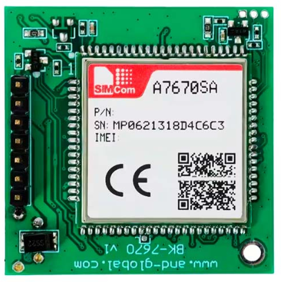
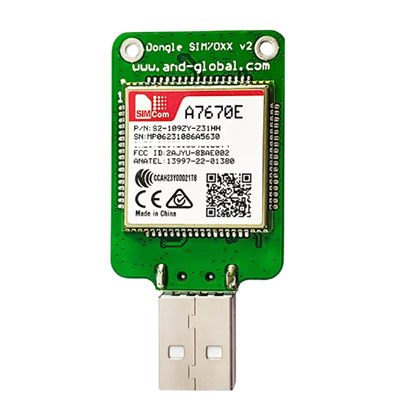
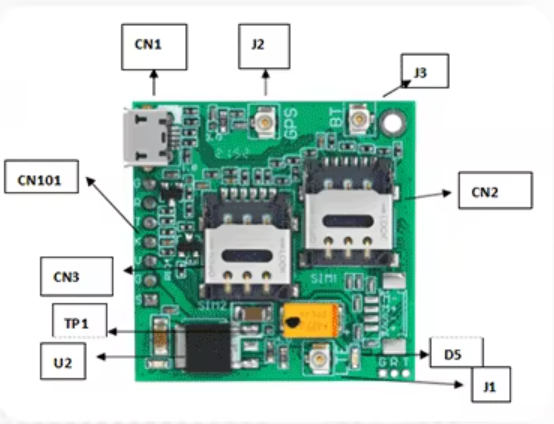
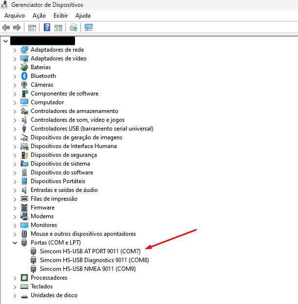
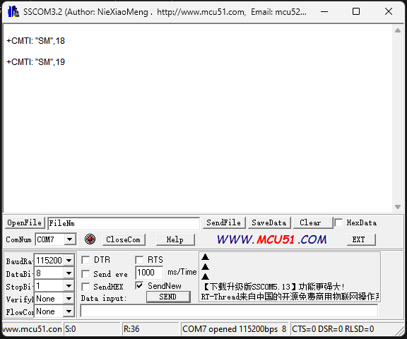
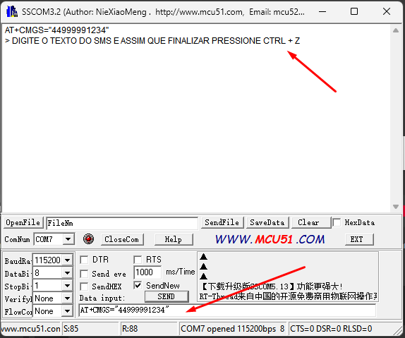

# Enviando SMS com C# e Módulo Simcom A7670SA AT/Serial #

## Introdução ##

Há algum tempo venho estudando formas realizar a comunicação a distância com placas de CI com finalidades diversas. Em uma das minhas últimas aventuras, um amigo próximo solicitou minha ajuda para para resolver um problema de um cenário muito específico: monitorar a temperatura de um aparelho em tempo real utilizando um sensor muito popular na industria, o PT-100.

No entanto, havia uma limitação: o local do do monitoramento não possuía infraestrutura de internet. Não havia cabo de rede e nem rede WiFi. Todavia possuía cobertura GSM, e com qualidade de sinal. Restara-me então estudar a comunicação GSM e prototipar um dispositivo de monitoramento. Assim, recorri aos meus conhecimentos de Arduino.

Resultado: Após meses de estudo, testando utilizar diversos módulos GSM populares, como SIM800L e SIM900, eu desisti. E para dar um ponto final a história, resolvi investir um pouco mais e adquirir um módulo GSM mais caro, só por desencargo de consciência. Para encurtar a história, encontrei o módulo A7670SA 4G LTE, fabricado pela SIMCOM. Assim que chegou, iniciei os testes do módulo utilizando comandos AT/Serial via porta COM no Windows. Minha ideia inicial era fazer funcionar via comandos Serial pelo PC para depois implementar no Arduino. E foi assim que surgiu a ideia: Integrar o módulo A7670SA com programação em dotnet!

Afinal de contas, já que o módulo permite a comunicação Serial, então funcionaria perfeitamente em uma integração em C#. E se você estiver perguntando qual foi o desfecho do projeto de sensor com o PT-100, infelizmente suspendemos o progresso, já que ele está bastante atarefado neste momento com as atividades de sua empresa. 

Em breve publicarei um outro artigo mostrando a finalização do projeto do sensor PT-100.

## Aplicações ##

As aplicações são infinitas. Até mesmo no projeto do sensor com o PT-100, a ideia inicial era realizar a comunicação *Client-Server* utilizando API e protocolo HTTPS, mas infelizmente descobri que há inúmeras limitações na utilização do módulo A7670SA em comunicação AT/Serial, sendo uma delas a impossibilidade de realizar comunicação utilizando o protocolo HTTPS.

Desde então, surgiu a possibilidade de integrar o sensor com o servidor utilizando torpedo SMS, pois o custo da troca de mensagens seria quase - senão - zero, uma vez que os SMS enviados para um número de mesma operadora não são tarifados. Tudo que eu precisaria era fazer o *Server* também se comunicar via SMS, para isso eu teria dois caminhos possíveis: 1. Caminho relativamente caro, utilizando API de serviço SMS e 2. Caminho barato, tendo um módulo GSM para o Servidor (A resposta parece ser obvia).

Pensando nesse tipo de arquitetura, podemos obter um número infinito de aplicações, dentre as quais teríamos:

* Sensores (como o sensor PT100 mencionado anteriormente);
* Dispositivos para controle remoto (fechaduras, interruptores eletrônicos, instrumentos de partida, etc);
* Dispositivos de Comunicação à Distância (semelhante aos Pagers da década de 1990);
* Dispositivos para Monitoramento à Distância (sensores de motores elétricos, equipamentos industriais, etc);
* Dispositivos de rastreamento (embora a ANATEL proíba a Módulos de rastreamento de veículos trafegarem dados via SMS)

Pensando nisso, primeiro passo que teríamos que dar seria o de implementar a comunicação com o módulo A7670SA no Server. Então nada melhor que utilizarmos a linguagem C# e o framework dotnet para implementar essa comunicação.

## Módulo SIMCOM A7670SA ##

O principal elemento de nosso estudo é o módulo GSM SIMCOM A7670SA, uma variação do tradicional SIM7600 que vem sendo utilizada na construção de circuitos que necessitam de comunicação GSM (Global System for Mobile). O A7670SA é um módulo robusto e poderoso, que permite conectar com rede 4G LTE e retrocompatibilidade com rede 2G. Uma grande vantagem desse módulo é que já está homologado e certificado pela ANATEL para funcionar no Brasil.

Outra  grande vantagem que temos ao utilizar o módulo A7670SA em projetos de comunicação GSM está relacionado ao seu custo de aquisição em relação a outros módulos com funções semelhantes, como o *Quectel BG96* e o *Quectel EC25*. O A7670SA foi projetado para atender as inúmeras necessidades de aplicações IoT (Internet of Things) e da comunicação M2M (Machine to Machine), porém tendo total compatibilidade com chips de operadoras comuns de telefonia do país, como Tim, Vivo, Oi e Claro.

Além disso, esse módulo possui suporte aos protocolos de comunicação TCP/UDP, FTP/FTPS, HTTP/HTTPS, MQTT e SSL/TLS. Porém, um ponto negativo é que o suporte aos protocolos HTTPS e TLS somente estão disponíveis via comunicação direta com o *Driver*, não sendo possível acessar tais recursos via comandos AT/Serial, mesmo estando conectados a um computador.




O módulo A7670SA está disponível em vários encapsulamentos de CI, sendo mais frequentemente encontrado em duas variações:

* ***USB Dongle*** - Muito utilizado como modens GSM em computadores e dispositivos *IOT* com suporte a SO (*Raspberry, Orange PI, Nvidia Jetson*, etc).
* **Módulo de Desenvolvimento** - Recomendado para comunicação *UART* (TX/RX) para conexão com placas de desenvolvimento (*Arduino, ESP32, Raspberry Pi*, etc.) e CLPs (Controladores Lógicos Programáveis), mas com suporte a conexão Micro USB.

A documentação do módulo A7670SA está disponível no site oficial do fabricante, e pode ser acessada através deste [link](https://www.simcom.com/product/A7670X.html).

### Especificações do A7670SA ###

Tanto a versão *USB Dongle* quanto o módulo de desenvolvimento do A7670SA possuem as seguintes especificações:

* Taxa máxima de Download: 10Mbps
* Taxa máxima de Upload: 5Mbps
* Compatível com as Bandas LTE-FDD B1/B2/B3/B4/B5/B7/B8/B28/B66 (O Brasil utiliza B3/B7/B28)
* Suporta modos de comunicação sem fio de LTE-TDD/LTE-FDD/GSM/GPRS/EDGE
* Adota fator de forma LGA e é compatível com a série SIM7000/SIM7070 (NB/Cat Modules)
* Suporte aos protocolos de comunicação TCP/UDP, FTP/FTPS, HTTP/HTTPS, MQTT, SSL/TLS e CoAP.

Você deve se atentar ao suporte ao HTTPS, SSL/TLS e FTPS, não sendo possível utilizar tais protocolos via comandos AT/Serial. Como faremos somente trocas de SMS entre dispositivos, não utilizaremos nenhum desses protocolos durante a programação do projeto.

### Overview ###

Neste estudo utilizaremos o Módulo de Desenvolvimento com conexão Micro USB, sendo a variação do módulo mais versátil, possuindo tanto os pinos de comunicação UART quanto a conexão Micro Usb, mas você poderá utilizar o *USB Dongle* sem problemas, pois terá a mesma função. 

Por ser mais simples, o A7670SA na sua versão *USB Dongle* somente precisa ser conectado a uma porta USB do computador e ter seu driver instalado, sendo compatível com Windows, Linux e MAC OS. Como utilizaremos o Módulo de Desenvolvimento, é de suma importância que você conheça as particularidades do componente nesta versão.



| Elemento | Descrição                           |
|----------|-------------------------------------|
| CN2      | Nano SIM card socket 1              |
| CN3      | Nano SIM card socket 2 (Opcional)   |
| CN101    | Pinos da interface de conexão TX/RX |
| CN1      | USB Interface                       |
| D5       | Luz indicadora de rede (Verde)      |
| U2       | Controlador de conversão de energia |
| J1       | Conector da antena da rede LTE      |
| J2       | Conector da antena do GPS           |
| J3       | Conector da antena do Bluetooth     |
| TP1      | Terminal 4.0V                       |

### Aquisição do módulo A7670SA ###

Embora o A7670SA seja uma variante bastante popular do módulo SIM7600, você provavelmente terá dificuldades para encontrá-lo em lojas especializadas. Até mesmo em grandes varejistas nacionais do ramo da eletrônica, esse módulo e específico não se encontra disponível, e quando se encontra, o custo de aquisição é bem alto.

Contudo a aquisição do módulo A7670SA poderá ser feita online, através de plataformas de compras internacionais, como Aliexpress, Banggood e Shopee. No ano da publicação deste artigo, o módulo poderia ser adquirido por aproximadamente USD 22,00 + impostos, que convertido representava R$ 120,00 \+ 50% de impostos, totalizando BRL 180,00.

Sites para aquisição do módulo A7670SA:

* [**Aliexpress - (Recomendado)**](https://pt.aliexpress.com/item/1005004176439432.html)
* [**Curto Circuito**](https://curtocircuito.com.br/modulo-a7670sa-4g-lte-antena-fcp.html?srsltid=AfmBOoohkWBEhf_MR6K0xRYZcMm7OGJoCLKNYUUH0zmpeuw0NpvyeMMJ)
* [**IOT Robótica**](https://www.iot-robotica.com.br/modulo-sim7670sa-4g-lte-gps---antena-fcp-gps)
* [**Mercado Livre**](https://produto.mercadolivre.com.br/MLB-4629454398-modulo-gsm-a7670sa-4g-lte-com-antena-fcp-_JM)

Ao adquirir o módulo, certifique-se que que atenda as Bandas de comunicação 4G utilizadas pelo Brasil (B3/B7/B28).

### Instalação e configuração do módulo A7670SA ###

Para que o módulo SIMCOM A7670SA funcione corretamente no computador, é necessário instalar o driver de comunicação com o dispositivo. O driver permite que o Sistema Operacional reconheça o dispositivo e também atribua uma porta COM (Windows), e que iremos utilizar nesse estudo.

O driver de comunicação com dispositivos da família SIM7600 pode ser encontrado com facilidade na internet, tendo a disposição vários locais para download. Contudo, no site do fabricante do módulo ([SIMCOM](https://www.simcom.com/)) não foi possível sequer encontrar o arquivo de instalação do driver para download. Por esse motivo, disponibilizarei um repositório do Github contendo todos os arquivos necessários para instalação, configuração e teste do módulo. Você poderá acessar através do [link](https://github.com/dcodebr/simcom_a7670sa_dotnet) ou clonando o repositório localmente através do comando *git clone*.

```sh
git clone https://github.com/dcodebr/simcom_a7670sa_dotnet.git
```

Os arquivos de instalação do driver estão disponíveis dentro da pasta [**_drivers**](https://github.com/dcodebr/simcom_a7670sa_dotnet/tree/main/_drivers). Você poderá encontrar as orientações de instalação no arquivo [**README.md**](https://github.com/dcodebr/simcom_a7670sa_dotnet/tree/main/_drivers) presente nesta pasta.

Após a instalação do driver, você poderá conectar o módulo A7670SA na porta USB de seu computador. É nessa hora que você precisará colocar o chip no Slot SIM 1 do módulo. Certifique-se de que o chip possua crédito, caso seja pré-pago, ou algum plano para envio de SMS.

Ao conectar o módulo, o Sistema Operacional já atribuirá as portas COM ao dispositivo, evidenciando o reconhecimento após a instalação do Driver. Você poderá observar isso ao acessar o Gerenciador de Dispositivos do Sistema Operacional Windows, conforme imagem a seguir.



Podemos observar que há três portas COM configuradas para o módulo, sendo a principal a primeira (COM7), que iremos utilizar neste estudo. As outras duas portas são referentes a análise de diagnósticos (COM8) e informações referentes ao rastreamento por GPS utilizando o protocolo NMEA (COM9). É provável que em seu computador outras numerações de portas COM sejam atribuídas ao módulo, a depender de outros periféricos conectados em seu computador. Anote a porta correta atribuída ao módulo em seu computador.

## Teste do módulo A7670SA com comandos AT/Serial ##

Antes de integrarmos o módulo A7670SA em qualquer projeto, é necessário testar sua comunicação. A forma mais simples de realizar esse processo é realizar a comunicação Serial utilizando comandos AT/Serial. Para essa tarefa, faremos uso do utilitário SSCOM32E.exe, um assistente de comunicação serial desenvolvido por [NieXiaoMeng](http://www.mcu51.com). Você poderá baixá-lo acessando a pasta ["_utils"](https://github.com/dcodebr/simcom_a7670sa_dotnet/tree/main/_utils) no repositório do GitHub.



Ao executar o SSCOM32E.exe, você verá uma interface com uma janela de comandos para parte superior (Memo) e um conjunto de controles e botões na parte inferior. Os controles são responsáveis por definir a comunicação com o módulo via COM/Serial. Recomendo atribuir os controles com os seguintes valores:

| Controle | Valor  |
|----------|--------|
| BaudRate | 115200 |
| DataBits | 8      |
| StopBits | 1      |
| SendNew  | ☑      |

Não se esqueça de informar a porta COM no campo ***ComNum***. Em nosso estudo, manterei a porta COM7 atribuida de forma automática.

Os comandos AT devem ser digitados no campo "Data input". Você deve você pode pressionar enter ou clicar no botão SEND para enviar os comandos ao módulo. Sendo assim, digite o primeiro comando de teste para verificar a comunicação com o módulo e o sinal:

```
AT
```

O resultado da execução do comando poderá ser visto o Memo, e caso tenha obtido sucesso, o resultado será este:

```
AT
OK
```

### Enviando o primeiro SMS no A7670SA através SSCOM32.exe ###

Após ter conseguido êxito na execução do comando AT, obtendo a resposta *OK*, podemos prosseguir enviando o primeiro SMS utilizando o módulo A7670SA. Para isso, vamos entender quais comandos iremos utilizar para realizar essa tarefa.

O primeiro comando a ser digitado refere-se à instrução de envio de SMS. Nele deverá estar contido o número de telefone de destino do torpedo SMS. Você deverá informar o número de telefone seguindo a máscara DDD000000000. Por exemplo, para o número (44) 99999-1234 digite "44999991234":

```
AT+CMGS="44999991234"
```

Assim que o comando for executado, o assistente aguardará você digitar a mensagem no Memo. Você deverá clicar no Memo e digitar a mensagem do SMS. Por se tratar de uma comunicação Serial e também do programa trabalhar com outro charset, recomendo não utilizar acentos ou caracteres especiais para evitar erros na execução do comando. Assim que finalizar, pressione as teclas **CTRL + Z**.



O resultado final da execução será:

```
AT+CMGS="44999991234"
> DIGITE O TEXTO DO SMS E ASSIM QUE FINALIZAR PRESSIONE CTRL + Z
+CMGS: 186
OK
```

Antes de finalizar o teste, podemos desabilitar o *echo* dos comandos AT. Isso permite que somente a resposta seja retornada após a execução do comando, impedindo o retorno do comando que originou de execução como cabeçalho da resposta. Esse comando será de extrema importância, pois o utilizaremos durante a comunicação Serial dentro da projeto com a linguagem C#. Para isso, digite:
```
ATE0
```

## Programação do Projeto em dotnet ##

Após a conclusão dos testes de envio do SMS, podemos iniciar a programação do projeto em C#. Por se tratar de comunicação serial, não há a necessidade de utilização de dependências de terceiros, muito menos de utilização de DLLs ou qualquer biblioteca de vínculo dinâmico da SIMCOM. A única dependência que o projeto terá é do namespace **System.IO.Ports**, nativa do próprio framework dotnet.

A versão do dotnet utilizada é a 8.0.104, porém também pode ser construído em versões anteriores a essa, inclusive ser feito utilizado o tradicional .NET Framework.

Todo código fonte do projeto está disponível na pasta [**dotnet**](https://github.com/dcodebr/simcom_a7670sa_dotnet/tree/main/dotnet) do repositório simcom_a7670sa_dotnet no Github. Torno a dizer que você pode clonar o repositório através do comando *git clone*:

```bash
git clone https://github.com/dcodebr/simcom_a7670sa_dotnet.git
```

### Elementos do Projeto ###

Todas as ações de comunicação com o módulo A7670SA dentro do projeto em dotnet resumem-se em dois arquivos principais, sendo o *SimcomA7670SASmsReadEnum.cs* e o *SimcomA7670SA.cs*. Vamos as definições:


* **SimcomA7670SASmsReadEnum.cs**: Contém o enum SimcomA7670SASmsReadEnum responsável por mapear os tipos de listagem das mensagens gravadas na memória do SIM. Os itens do enum estão associados ao comando *AT+CMGL*, responsável por listar as mensagens gravadas. Os valores possíveis são:
    * **ALL**: Todas as mensagens, lidas e recebidas.
    * **REC UNREAD**: Mensagens recebidas não lidas.
    * **REC READ**: Mensagens recebidas e lidas.
    * **STO UNSENT**: Mensagens não enviadas.
    * **STO SENT**: Mensagens enviadas.

    A sintaxe do comando *AT+CMGL* é a seguinte:

    ```
    AT+CMGL="ALL"
    ```

    E o resultado costuma ser algo neste formato:

    ```
    AT+CMGL="ALL"
    +CMGL: 18,"REC READ","8462","","24/11/16,20:48:13+92"
    Alex, SUPERPROMO: Apenas 29,99/mes no plano de 27GB, WhatsApp e Messenger ilimitados e ligacoes a vontade: controletim.com.br/ATUMSGX

    +CMGL: 19,"REC READ","8462","","24/11/17,15:50:00+92"
    Alex, OPORTUNIDADE UNICA: TIM CONTROLE com 27GB, ligacoes, WhatsApp e Messenger ilimitados por 29,99/mes! controletim.com.br/ATUMSGX

    OK
    ```

* **SimcomA7670SA.cs**: É o arquivo principal, que contém a classe SimcomA7670SA, responsável por toda comunicação Serial com o módulo A7670SA. A classe é capaz de enviar SMS e listar todas as mensagens, enviadas e recebidas pelo SIM. 


#### Enum para listagem de SMS (*SimcomA7670SASmsReadEnum*): ###

```csharp
using System.ComponentModel;

public enum SimcomA7670SASmsReadEnum {
    [Description("ALL")] All = 1,
    [Description("REC UNREAD")] RecUnread = 2,
    [Description("REC READ")] RecRead = 3,
    [Description("STO UNSENT")] StoUnsent = 4,
    [Description("STO SENT")] StoSent = 5
}
```

#### Classe de Comunicação Serial com o módulo (*SimcomA7670SA*): ###

```csharp
using System.IO.Ports;

public class SimcomA7670SA
{
    private SerialPort SerialPort { get; set; }
    public string PortName { get; private set; }
    public int BaudRate { get; private set; }
    public int DefaultTimeout { get; set; }
    public int DataBits => 8;
    public StopBits StopBits => StopBits.One;

    public SimcomA7670SA(string portName, int baudRate, int defaultTimeout = 1000)
    {
        PortName = portName;
        BaudRate = baudRate;
        DefaultTimeout = defaultTimeout;

        SerialPort = new SerialPort()
        {
            PortName = PortName,
            BaudRate = BaudRate,
            DataBits = DataBits,
            StopBits = StopBits
        };
    }

    private void SerialPortOpen(int? writeTimeout = null, int? readTimeout = null)
    {
        SerialPort.Open();
        SerialPort.WriteTimeout = writeTimeout ?? DefaultTimeout;
        SerialPort.ReadTimeout = readTimeout ?? DefaultTimeout;
    }

    private void SerialPortClose()
    {
        SerialPort.Close();
    }

    private void SerialPortDisableEcho()
    {
        SerialPort.WriteLine("ATE0\r");
        SerialPortReadFullResponse();
    }

    private void SerialPortSetTextMode()
    {
        string cmgfCommand = "AT+CMGF=1\r";
        SerialPort.WriteLine(cmgfCommand);
        SerialPortReadFullResponse();
    }

    private string SerialPortReadFullResponse()
    {
        var result = string.Empty;

        while (SerialPort.BytesToRead > 0)
        {
            result += SerialPort.ReadExisting();
        }

        return result;
    }


    public string SendATCommand(String command, int? writeTimeout = null, int? readTimeout = null)
    {
        string atCommand = $"{command}\r";
        SerialPortOpen(writeTimeout, readTimeout);
        SerialPortDisableEcho();

        SerialPort.WriteLine(atCommand);
        string result = SerialPortReadFullResponse();
        SerialPortClose();

        return result;
    }

    public string SendSMS(string phoneNumber, string message)
    {
        string cmgsCommand = $"AT+CMGS=\"{phoneNumber}\"\r";
        string messageCommand = $"{message}\x1A";

        SerialPortOpen();
        SerialPortDisableEcho();

        SerialPort.WriteLine(cmgsCommand);
        Thread.Sleep(200);
        SerialPortReadFullResponse();

        SerialPort.WriteLine(messageCommand);
        Thread.Sleep(2000);
        var result = SerialPortReadFullResponse();
        
        SerialPortClose();

        return result;
    }

    public string ListSMS(SimcomA7670SASmsReadEnum smsRead)
    {
        var smsReadType = smsRead.GetDescription();
        var cmglCommand = $"AT+CMGL=\"{smsReadType}\"\r";

        SerialPortOpen();
        SerialPortDisableEcho();

        SerialPort.WriteLine(cmglCommand);
        Thread.Sleep(2000);

        var result = SerialPortReadFullResponse();
        SerialPortClose();

        return result;
    }

    public string ReadSMS(int index)
    {
        var cmgrCommand = $"AT+CMGR={index}\r";

        SerialPortOpen();
        SerialPortDisableEcho();

        SerialPort.WriteLine(cmgrCommand);

        Thread.Sleep(2000);
        var result =SerialPortReadFullResponse();
        SerialPortClose();

        return result;
    }

    public string DeleteSMS(int index)
    {
        var cmgdCommand = $"AT+CMGD={index}\r";

        SerialPortOpen();
        SerialPortDisableEcho();

        SerialPort.WriteLine(cmgdCommand);
        var result = SerialPortReadFullResponse();
        SerialPortClose();

        return result;
    }
}
```

### Instanciação e utilização do objeto de comunicação Serial: ###

Para instanciar um objeto responsável pela comunicação, você deverá informar ao menos a porta COM do módulo e o BaudRate. Os valores são os mesmos utilizados no assistente SSCOM32E.exe. Por padrão, o valor do BaudRate é 115200.

```csharp
var simModule = new SimcomA7670SA("COM7", 115200);
```

#### Enviar SMS ####

O envio de SMS é muito simples. Basta acionar o método *SendSMS(phoneNumber, message)*, conforme exemplo a seguir:

```csharp
string result = simModule.SendSMS("44999991234", "TESTANDO ENVIO DE SMS EM CSHARP!");
```

O resultado do comando é uma string contendo o status *OK* ou a mensagem "ERROR" juntamente com o motivo do insucesso do envio.

#### Listar SMS ####

A listagem de SMS acontece por intermédio do método *ListSMS(listSmsType)*, que deve ser informado o tipo de listagem desejada. O retorno será uma string contendo todas as mensagens da listagem.

```csharp
string result = simModule.ListSMS(SimcomA7670SASmsReadEnum.All);
```

#### Ler SMS ####

Por fim, para realizar a leitura de um SMS, marcando a mensagem como lida, será necessário informar o índice da mensagem para o método *ReadSMS(index)*. O índice pode ser obtido através da listagem de SMS não lidos, sendo o valor que sucede o prefixo *"+CMGL: "* de cada mensagem. Por exemplo:

```
AT+CMGL="REC UNREAD"
+CMGL: 19,"REC UNREAD","8462","","24/11/17,15:50:00+92"
Alex, OPORTUNIDADE UNICA: TIM CONTROLE com 27GB, ligacoes, WhatsApp e Messenger ilimitados por 29,99/mes! controletim.com.br/ATUMSGX

OK
```

Sendo assim, podemo executar o método *ReadSMS(index)* passando o valor *19* como argumento para o parâmetro *index*. O resultado será uma string contendo a estrutura do SMS, porém agora com o status "REC READ":

```csharp
string result = simModule.ReadSMS(19);
```

## Conclusão ##

Neste estudo, podemos entender como funciona a comunicação AT/Serial com um módulo GSM da família SIM7600, o A7670SA, produzido pela SIMCOM. Através dele, podemos - entre tantas outras ações - enviar e receber SMS via comandos AT. Com isso, podemos também realizar integrações com aplicações desenvolvidas em dotnet utilizando a linguagem C#, permitindo enviar e recepcionar torpedos SMS e implementar diversas aplicações utilizando o conceito de troca de informações por SMS.